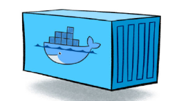

# Docker


Docker 란 무엇일까?

Docker란 하나의 운영체제에 얽매이지 않고
다양한 운영체제를 손쉽고 빠르게 만들어 운영할 수 있으며,
이미 많은 모듈들이 배포되어있는 상태라 쓰고 버리기 간편하다.

# Image


Image란 무엇일까?

위와같이 Docker는 Dockerfile 이란 것을 기반으로 만들어지는데

Image 는 이런 만들어진 것을 찍어내는 기계 정도로 생각하는 것이 편하다

실제로 뒤에 알아보겠지만 Container 라는 것을 만드는 용도로 사용된다.

# Container



Container 란 말 그대로 Image로 찍어낸 생산물 그 자체를 말한다.

---

즉 정리하자면

1. Dockerfile 로 만들어진 것을 배포함.

2. 이렇게 만들어진 파일을 Image로 읽어옴

3. 읽어온 Image를 원하는 만큼 찍어낸 것이 Container

# Commands


```javascript
docker images
// 도커의 이미지 리스트를 불러옴
```


```javascript
docker ps
// -a(실행중이 아닌 Container 들도)
// -q (Container 의 ID값만)
// 도커의 컨테이너 리스트를 불러옴
```


```javascript
docker inspect (이미지 명)
// 해당 이미지의 정보를 가져옴
```

# Remove Image


```javascript
docker rmi (이미지 ID)
// 해당 이미지의 정보를 삭제함
```

# Remove Container

```javascript
docker stop (컨테이너 별명 혹은 ID)
// 컨테이너를 중지함 (삭제 전 필수사항)
docker rm (컨테이너 별명 혹은 ID)
// 컨테이너를 삭제한다
```

# Pull Image

```javascript
docker pull (Image 이름)
// 해당 이미지를 설치함
```
